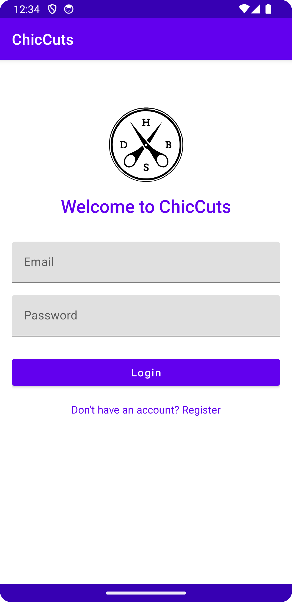
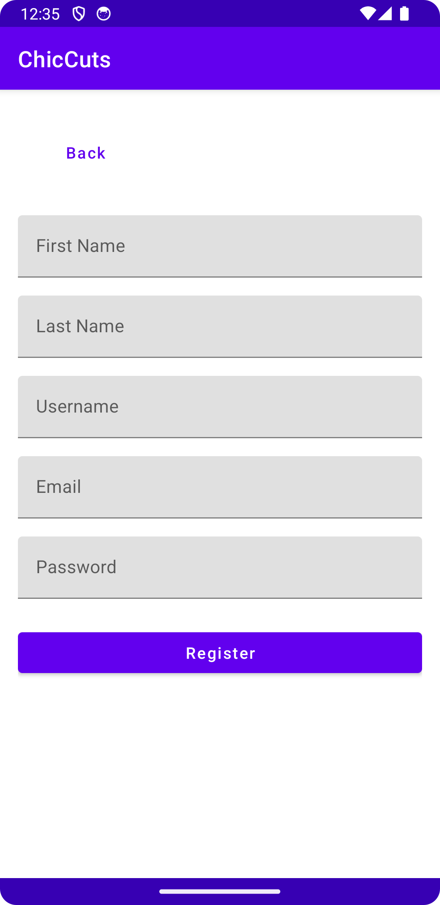
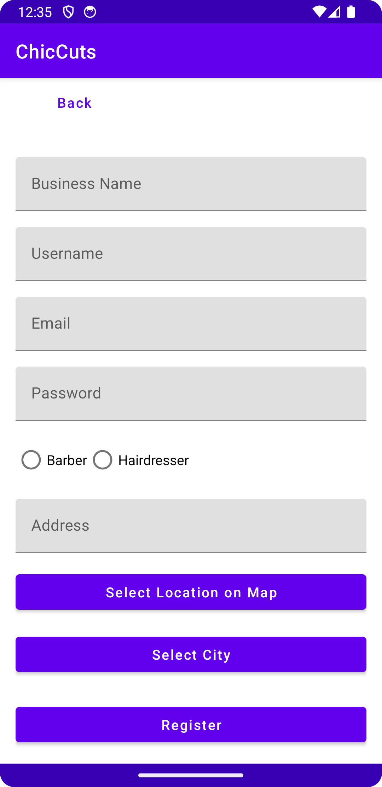
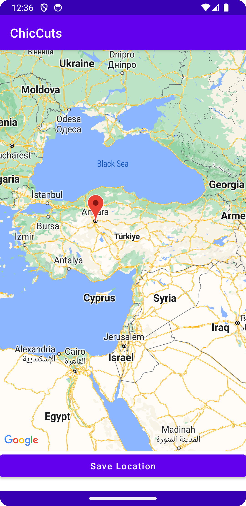
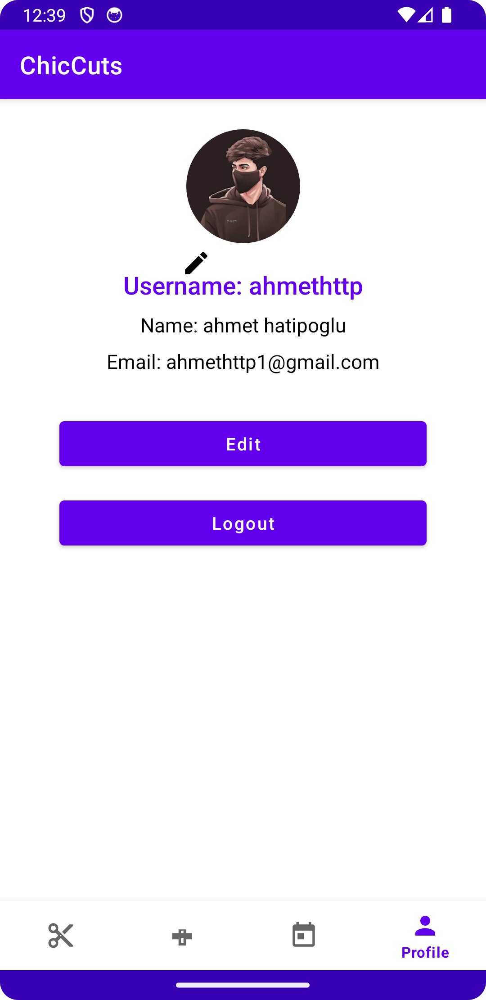
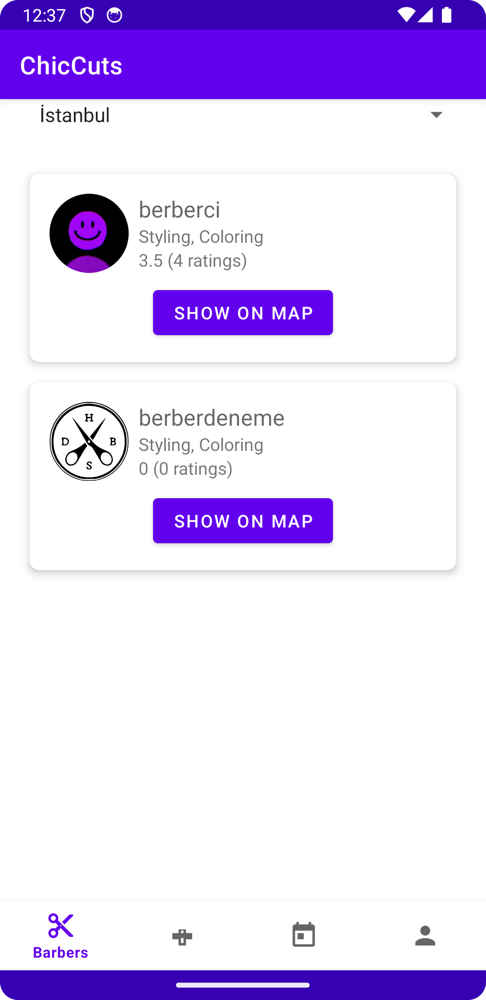
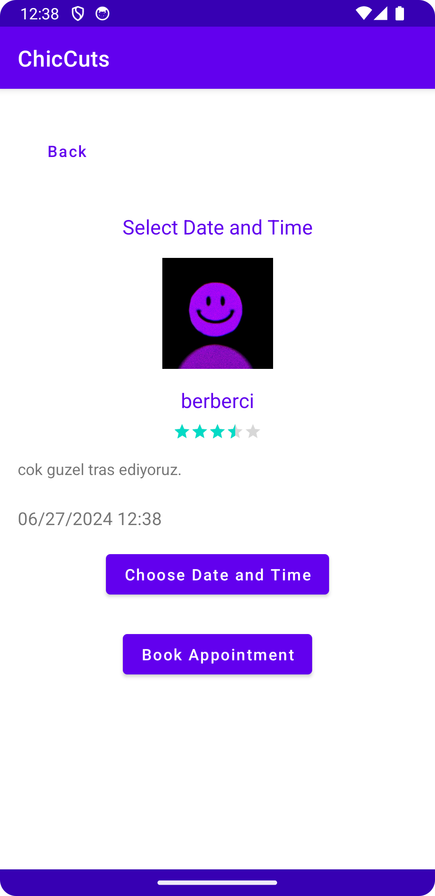
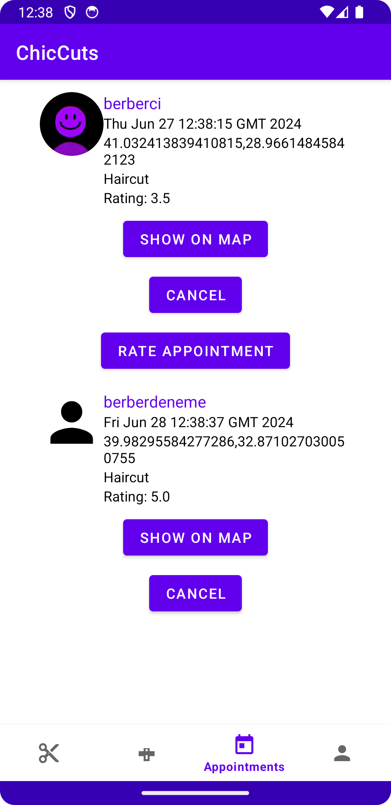
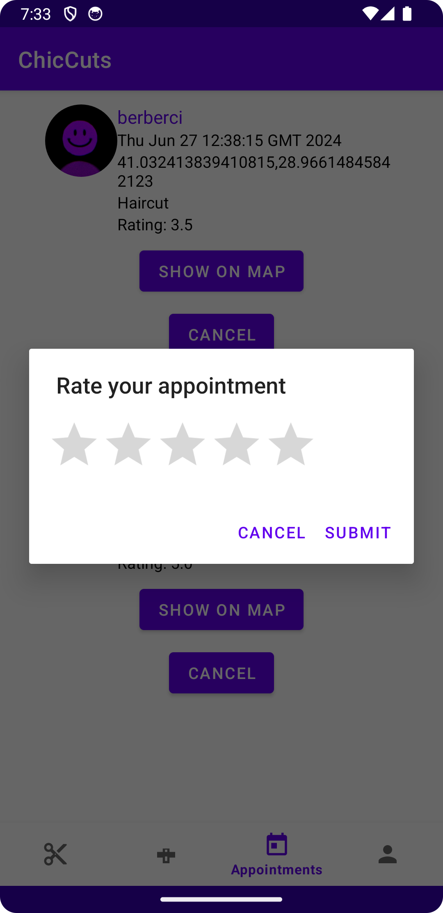

# ChicCuts - Mobile Application

ChicCuts is a mobile application developed for the Android platform, designed to help users easily schedule appointments with barbers and hairdressers. With a user-friendly interface and advanced features, ChicCuts aims to revolutionize the personal care services industry.

## Features

- **User Management:** Allows creation of both customer and business accounts.
- **Appointment Management:** Users can book and manage appointments for various services.
- **Business Profile Management:** Businesses can manage their profiles, define and update their services.
- **User Reviews and Ratings:** Users can leave reviews and ratings for the services they receive.
- **Map Integration:** Users can locate nearby barbers and hairdressers on the map and get directions.

## Technologies Used

- **Kotlin:** Programming language for Android development.
- **Google Firebase:**
  - Real-time Database
  - User Authentication
  - Cloud Storage
- **Google Maps API:** Used for map and location functionalities.
- **Material Design:** Applied for user interface design.

## Screenshots

### Login Screen


### User Registration


### Business Registration


### Business Location Selection


### Profile Screen


### Barber Screen


### Appointment Booking


### Appointment Screen


### Appointment Rating



## Installation

1. Clone the repository to your local machine:
    ```bash
    git clone https://github.com/AhmetHTTP/ChicCuts.git
    ```

2. Open the project in Android Studio.

3. Sign in to Firebase and add the `google-services.json` file to your project's `app` directory.

4. Sync Gradle to install the necessary dependencies.

5. Run the project by clicking the `Run` button.

## Usage

- **User Registration:** On first launch, users can register as either a customer or a business.
- **Booking Appointments:** Customers can select available time slots to book appointments.
- **Business Management:** Business owners can manage their services and appointment times.
- **Using Maps:** Users can view nearby businesses on the map and obtain address details.

## Contributing

We welcome contributions! Please open an issue before making any changes and provide details about your contribution in the project's discussions section.

1. Fork the repository (click the "Fork" button at the top right)
2. Create a feature branch (`git checkout -b feature/FeatureName`)
3. Commit your changes (`git commit -m 'Add a feature'`)
4. Push to the branch (`git push origin feature/FeatureName`)
5. Open a pull request

## License

This project is licensed under the MIT License - see the [LICENSE](LICENSE) file for details.
